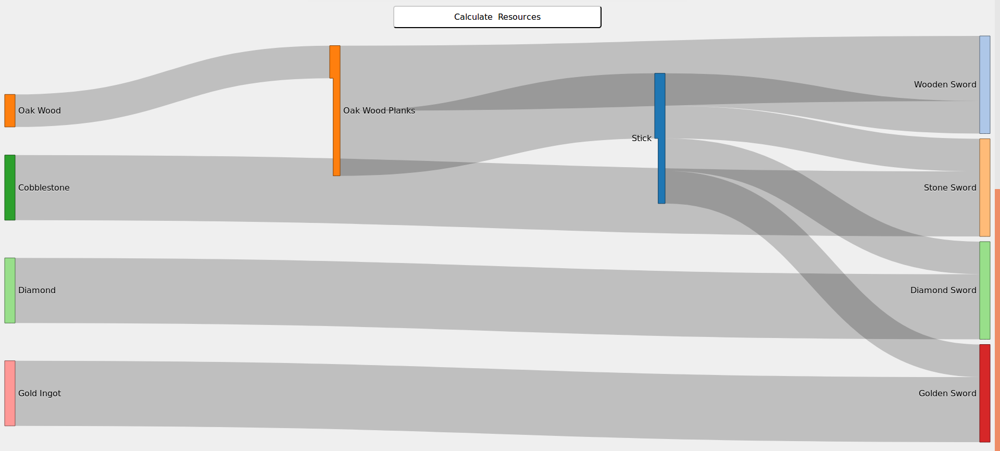

ResourceCalculator.com is a website that can calculate required resources from a list of final requirements, and tell you how to get from the raw resources to the final resources.




Creating or Updating a Calculator
=================================
If you want to add a new resource list to the calculator, you will only need 4 things:  
1. A folder in `resource_lists/` for all the files to live in (eg: [resource_lists/minecraft](resource_lists/minecraft))
2. A **460px** by **215px** thumbnail of the game you are making a calculator for (eg: [resource_lists/minecraft/icon.jpg](resource_lists/minecraft/icon.jpg))
    * These are the same dimensions as the thumbnail in the Steam store.
3. A set of rectangular images of uniform size for each of the resources (eg: [resource_lists/minecraft/items/](resource_lists/minecraft/items/))
4. The list of resources and what is needed to obtain them (eg: [resource_lists/minecraft/resources.yaml](resource_lists/minecraft/resources.yaml))

resources.yaml
--------------
The resource list is a yaml file that contains all the recipes for each item in the game. All items will have a "Raw Resource" type to allow users to ignore any materials needed for crafting that resource, and because some resources are base resources that you cannot craft.
Though key/value mappings are not inherently ordered, when we build the calculator page, their order is preserved from the yaml file
allowing one to order the items coherently.
```
resources:
  Lithium:
    recipes:
    - recipe_type: Raw Resource

  Small Battery:
    recipes:
    - output: 1
      recipe_type: Backpack Printer
      requirements:
        Lithium: -1
    - recipe_type: Raw Resource

  Medium Battery:
    recipes:
    - output: 1
      recipe_type: Printer
      requirements:
        Lithium: -2
    - recipe_type: Raw Resource
```
For ease of reading we will always have the key order be `output`, `recipe_type`, `requirements`, and then optionally `extra_data` where you can store extra information about the item in an unstructured map

items/[itemname].png
-----------
For each item in your resources.yaml file you will need to have an image for that resource. If an image is missing, then the build process will submit a warning and fill that space with a purple color, indicating it does not have an icon.
The icons can be any size, even rectangular, but they all must be the same size as each other for a given calculator.
The file names of each file should be the resource name in all lower case with no spaces or punctuation.  

For Example:  
*"Pink Stained Glass Pane"* becomes *[pinkstainedglasspane.png](resource_lists/minecraft/items/pinkstainedglasspane.png)*  
*"Jack 'o Lantern"* becomes *[jackolantern.png](resource_lists/minecraft/items/jackolantern.png)*

icon.jpg
--------
The icon needs to be `460px` by `215px` to fit in with the other calculator links. It also needs to be a `jpg`, not a `png` or other image file. If a game is on Steam, the Steam page for a game uses a `jpg` thumbnail with those dimensions. Simply downloading it to the appropriate directory and renaming it to `icon.jpg` should be all that is needed.

Prefer images that only contain the title/tagline (left) rather than ones for a specific event and/or with reviews (right).

<details>
    <summary>See Thumbnail Examples</summary>
    


</details>

The first URL below will show the current header, while the second URL can be used to browse all historical thumbnails by changing the number.
```
https://cdn.akamai.steamstatic.com/steam/apps/{SteamAppID}/header.jpg
https://cdn.cloudflare.steamstatic.com/steam/apps/{SteamAppID}/header_alt_assets_1.jpg
```
`SteamAppId` can be located by opening the store page for any Steam game: `https://store.steampowered.com/app/{SteamAppID}/Game_Name/`

Compiling The Calculator
========================

Docker
------
The primary method for building resource calculator is using Docker and Docker Compose. As long as you have Docker Compose on your system you should be able to run the `./run.sh` command from any terminal that can run a shell script. This will start two docker containers, one which will build the calculator and one which will host the calculator output so you can easily access it via a web browser. It is recommended to use the `./run.sh --watch` flag, this will tell the build script to automatically re-build any changes you make without needing to relaunch the build script.

The docker container will install the node and python libraries into the `node_modules` and `venv_docker` folders.

**NOTE:** For Docker on Windows you may need to allow the docker container to access the repo files. This should be prompted to you the first time you run it but if it does not prompt then this can be done via Settings -> Resources -> File Sharing

**NOTE:** For Docker on Windows file events are not always shared with the docker container, meaning that the `--watch` option will not always catch errors. To workaround this you can attempt to install and run [docker-windows-volume-watcher](https://pypi.org/project/docker-windows-volume-watcher/) however this does not seem to work with newer versions of docker desktop.

Linux
-----
On Linux, you will need to have Python 3.8 or newer installed as well as several python dependencies found in requirements.txt
```
sudo apt install python3 python3-pip pngquant npm
pip3 install -r requirements.txt
npm install
python3 build.py --watch
```

Windows
-------
On windows it is recommended to use the Docker runtime. However if you do not wish to use it you can install the dependencies manually just like on Linux.


MacOS
-----
On macos it is recommended to use the docker runtime. However if you do not wish to use it you can install the dependencies manually just like on Linux.
